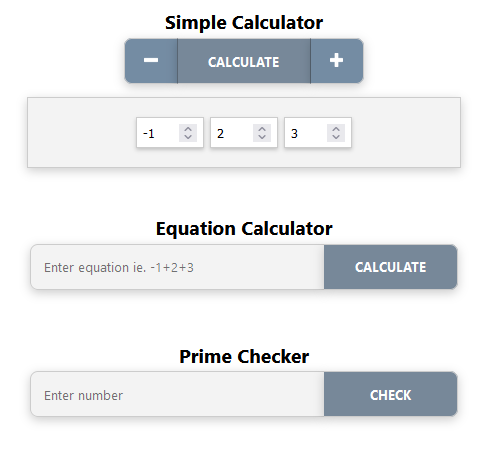

# Description
React based frontend application for simple calculator.  
Backend repository: https://github.com/HessuRessu/calculator-backend

# Development install (Optional)

To install required packages please use following command after cloning the repository:
```
npm install
```

To run application in development mode use command:
```
npm start
```

Application is served at port 3000 in development mode.

# Building Docker Image

<b>Note:</b> .env file contains only non-sensitive URL configuration for backend service.

Execute following command to build docker image:
```
docker build -t calculator-frontend .
```

Alternatively, for Windows use provided run.bat batch script to build:
```
run build
```

# Running in Docker

Execute following command to run application:
```
docker run -d --name calculator-frontend -p 8080:8080 calculator-frontend
```

Alternatively, for Windows use provided run.bat batch script to run container:
```
run start
```

# Docker Cleanup

Execute following command to cleanup running container:
```
docker stop calculator-frontend && docker rm calculator-frontend
```

Or by forcefully stop & remove running container:
```
docker rm -f calculator-frontend
```

Alternatively, for Windows use provided run.bat batch script to cleanup running container:
```
run stop
```

# Usage (Docker)

By default, container will expose port 8080, which may be accessed with browser by url: http://localhost:8080

GUI offers three functions Simple Calculator, Equation Calculator and Prime Checker as follows:



<b>Simple Calculator</b>  
Numbers can be added to Simple Calculator by clicking plus button and removed by clicking minus button. Calculate button calls backend to sum up given numbers.

<b>Equation Calculator</b>  
List of numbers can be inputted to Equation Checker if form of equation ie. 1+2+3.  
Negative numbers are handled as normal substraction within equation.  
Input -1+2+3-4 will be parsed to numeric array [-1, 2, 3, -4].

Input field will accept only numeric characters and +/- signs.

<b>Prime Checker</b>  
Add number to input field and click Check button to check if it is a prime number or not.

<b>Notes</b>  
Developer console will reveal each API call upon calculation. This is left intentionally in place in order to confirm API calls.
